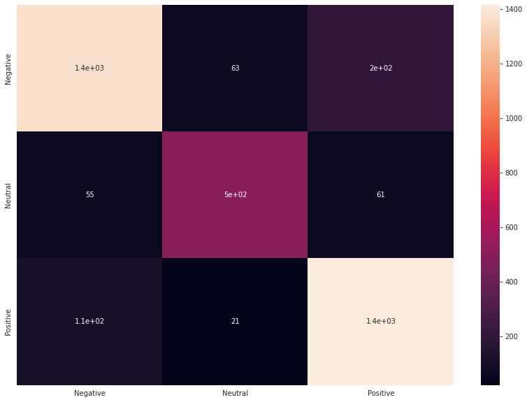

# COVID-19 Tweets Sentiment Analysis

## Overview
The COVID-19 pandemic has had a profound global impact, and social media has emerged as a crucial source of information and communication. With millions of tweets being shared daily, analyzing public sentiment toward COVID-19 is essential. This project utilizes the **BERT (Bidirectional Encoder Representations from Transformers)** classifier model to perform sentiment analysis on COVID-19-related tweets.

---

## Dataset
The tweets were sourced from Twitter and manually tagged to ensure accuracy. To maintain privacy, names and usernames were anonymized. The dataset can be accessed [here](https://www.kaggle.com/datasets/datatattle/covid-19-nlp-text-classification).

**Columns:**
1. **Location** 🌍  
2. **Tweet At** 📅  
3. **Original Tweet** 🐦  
4. **Label** 💬  

---

## Data Preprocessing
The dataset was cleaned and prepared using a **Preprocessor class**, which performed the following operations:
1. Removed missing values and duplicate rows.  
2. Lowercased text.  
3. Removed mentions, hashtags, URLs, punctuation, HTML tags, double spaces, stop words, and numbers.  
4. Applied lemmatization to the text.  

---

## Data Analysis
The analysis revealed the following sentiment distribution among tweets:
- **19% Neutral**  
- **44% Positive**  
- **37% Negative**  

### Key Insights
- **Word Clouds:** Generated visualizations for each sentiment category, highlighting the most frequently used words.  
- **Bar Charts:** Displayed common words in each category to identify themes.  
- **Origin Countries:** Most tweets originated from `Unknown`, `England`, `United States`, and `India`.  
- **Popular Hashtags and Mentions:**
  - Hashtags: `#coronavirus`, `#covid_19`, `#Coronavirus`, `#COVID2019`, `#COVID19`.  
  - Mentions: `@realdonaldtrump`, `@youtube`, `@borisjohnson`, `@tesco`, `@amazon`.  

---

## Model
A custom **BertClassifier** was used for sentiment analysis. It incorporates the pre-trained **BERT** model, followed by fully connected layers for classification.

### Model Architecture
```python
class BertClassifier(nn.Module):
    def __init__(self, class_num):
        super(BertClassifier, self).__init__()
        self.bert = BertModel.from_pretrained('bert-base-cased')
        self.fc = nn.Sequential(
            nn.Linear(768, 256),
            nn.Dropout(0.2),
            nn.ReLU(),
            nn.Linear(256, 128),
            nn.Dropout(0.3),
            nn.ReLU(),
            nn.Linear(128, class_num),
        )

    def forward(self, input_ids, mask):
        _, pooled_output = self.bert(input_ids=input_ids, attention_mask=mask, return_dict=False)
        return self.fc(pooled_output)
```

---

## Results ✅
After **5 epochs**, the model achieved:
- **Training Accuracy:** 97%  
- **Validation Accuracy:** 89%  
- **Test Accuracy:** 87%  

### Confusion Matrix


---

## Inference Results
The trained model was used to predict sentiments for new text data. Here are a few examples:

```plaintext
Text: This can't be worse. People are dying.  
Predicted Sentiment: Negative  

Text: Good news is coming.  
Predicted Sentiment: Positive  

Text: Another boring day in quarantine...  
Predicted Sentiment: Negative  

Text: Second wave of #COVID19 in Flanders...back to more #homework again.  
Predicted Sentiment: Neutral  

Text: I lost my cousin because of CORONAVIRUS last week. Can't believe it.  
Predicted Sentiment: Negative  

Text: I got vaccinated today. Hope this #COVID19 ends soon.  
Predicted Sentiment: Positive  
```

---

This project provided valuable insights into public sentiment during the COVID-19 pandemic and demonstrated the effectiveness of the **BERT** model in text classification tasks.
